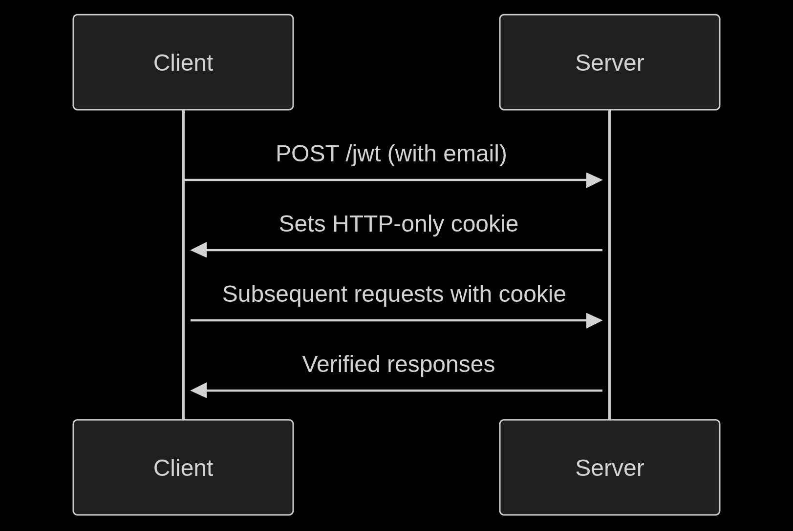

# 🍔 FoodBD REST API


A secure REST API for food inventory management with JWT authentication and CRUD operations.

 ## 📦 Environment Variables
Create a .env file in root directory with these variables:

```env
# Server Configuration
PORT=5000
NODE_ENV=development

# MongoDB Atlas
DB_USER=your_db_username
DB_PASS=your_db_password
DB_NAME=foodsdb
DB_CLUSTER=cluster0.onrfrlh

# JWT
JWT_SECRET=your_strong_secret_here
JWT_EXPIRES_IN=2h

# CORS Origins
FRONTEND_PROD_URL=https://food-garden-bd.web.app
FRONTEND_DEV_URL=http://localhost:5173
```
🔐 Authentication Flow

## Diagram


## 🚀 Deployment
Local Development
```bash
pnpm install
pnpm start
```
Production Recommendations
Set NODE_ENV=production

Use HTTPS in production

Configure proper MongoDB Atlas IP whitelisting

Set appropriate CORS origins

## 📚 API Documentation

| Endpoint               | Method | Auth Required | Description                     |
|------------------------|--------|---------------|---------------------------------|
| `/jwt`                 | POST   | ❌            | Generate JWT token              |
| `/foods`               | GET    | ❌            | Get all food items              |
| `/foods`               | POST   | ✔️            | Add new food item               |
| `/foods/:id`           | GET    | ✔️            | Get single food item            |
| `/foods/:id`           | PUT    | ✔️            | Update food item                |
| `/foods/:id`           | DELETE | ✔️            | Delete food item                |
| `/foods/notes/:id`     | POST   | ✔️            | Add note to food item           |

## 🛡️ Security Features
HTTP-only cookies with SameSite=None and Secure flags

JWT expiration (2 hours)

Origin-restricted CORS policy

Environment-based configuration

Proper error handling

📦 Dependencies
Runtime: Node.js 18+

Database: MongoDB Atlas

Packages:

express@5.x

mongodb@6.x

jsonwebtoken@9.x

cors@2.x

## 📜 License
ISC Licensed. See LICENSE for full text.

